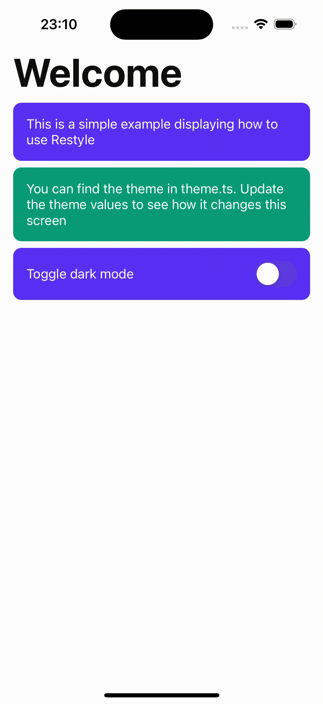

**Build a consistent, themed UI in minutes.**

This library is basically the same as [@shopify/restyle](https://shopify.github.io/restyle/), but now your props can be **number/string/defined-in-theme or all of them**, and with a lot of shortened attributes.
<br/>

<div align='center'>
  
</div>
<br/>

## Installation

Add the package to your project using one of the following:

```bash
yarn add rn-restyle
```

```bash
npm install rn-restyle
```

## Usage

```jsx
import * as React from 'react';

import { darkTheme, theme } from './theme';
import { View, SafeAreaView as RNSafeAreaView, Switch } from 'react-native';

import { createText, createRestyleComponent, ThemeProvider } from 'rn-restyle';

const Text = createText(theme);
const Box = createRestyleComponent(theme, View);
const SafeAreaView = createRestyleComponent(theme, RNSafeAreaView);

export default function App() {
  const [darkMode, setDarkMode] = React.useState(false);

  const selectedTheme = darkMode ? darkTheme : theme;

  return (
    <ThemeProvider theme={selectedTheme}>
      <Box bg="background" fill>
        <SafeAreaView fill>
          <Box flex={1} px="m" g={8}>
            <Text variant="header">Welcome</Text>
            <Box bg="cardPrimaryBackground" p="m" br={10}>
              <Text variant="body">
                This is a simple example displaying how to use Restyle
              </Text>
            </Box>
            <Box bg="cardSecondaryBackground" p="m" br={10}>
              <Text variant="body">
                You can find the theme in theme.ts. Update the theme values to
                see how it changes this screen
              </Text>
            </Box>
            <Box
              bg="cardPrimaryBackground"
              row
              between
              align="center"
              p="m"
              br={10}
            >
              <Text variant="body">Toggle dark mode</Text>
              <Switch
                value={darkMode}
                onValueChange={(value: boolean) => setDarkMode(value)}
              />
            </Box>
          </Box>
        </SafeAreaView>
      </Box>
    </ThemeProvider>
  );
}
```

## Inspiration

rn-restyle is is heavily inspired by [@shopify/restyle](https://shopify.github.io/restyle/), but with an extra set of making everything a little bit easier and shorter.

## Contributing

For help on setting up the repo locally, building, testing, and contributing
please see [CONTRIBUTING.md](https://github.com/stephen-golban/rn-restyle/blob/main/CONTRIBUTING.md).

## Code of Conduct

All developers who wish to contribute through code or issues, take a look at the
[CODE_OF_CONDUCT.md](https://github.com/stephen-golban/rn-restyle/blob/main/CODE_OF_CONDUCT.md).
